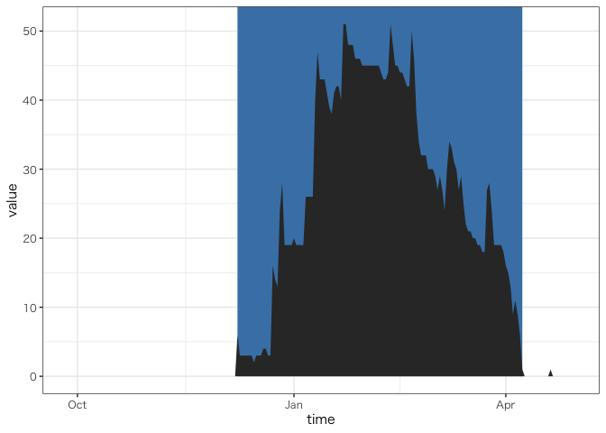

<!-- README.md is generated from README.Rmd. Please edit that file -->

# winter

<!-- badges: start -->

<!-- badges: end -->

冬の経時データをよしなに扱うパッケージ

## Installation

You can install the released version of winter from
[CRAN](https://CRAN.R-project.org) with:

``` r
install.packages("winter")
```

And the development version from [GitHub](https://github.com/) with:

``` r
# install.packages("devtools")
devtools::install_github("KeachMurakami/winter")
```

## Example

``` r
library(winter)


# get snow data
library(amgsds)
#> Loading required package: abind
#> Loading required package: leaflet
#> Warning: package 'leaflet' was built under R version 3.5.2
#> Loading required package: mapview
#> Warning: package 'mapview' was built under R version 3.5.2
#> Loading required package: ncdf4
#> Warning: package 'ncdf4' was built under R version 3.5.2
#> Loading required package: progress
#> Warning: package 'progress' was built under R version 3.5.2
#> Loading required package: RCurl
#> Warning: package 'RCurl' was built under R version 3.5.2
#> Loading required package: bitops
#> 
#> Attaching package: 'RCurl'
#> The following object is masked from 'package:tidyr':
#> 
#>     complete
#> Loading required package: rvest
#> Warning: package 'rvest' was built under R version 3.5.2
#> Loading required package: xml2
#> Warning: package 'xml2' was built under R version 3.5.2
#> 
#> Attaching package: 'rvest'
#> The following object is masked from 'package:purrr':
#> 
#>     pluck
#> The following object is masked from 'package:readr':
#> 
#>     guess_encoding
#> Loading required package: sf
#> Warning: package 'sf' was built under R version 3.5.2
#> Linking to GEOS 3.7.2, GDAL 2.4.2, PROJ 5.2.0
#> ℹ WELCOME to R-AMGSDS interface (ver.0.0.1.51) 
#>   
#> ● 農研機構は、農業分野や他の分野における研究・開発・教育・試用を目的とする者に、審査に基づきメッシュ農業気象データ（以下、「このデータ」と呼ぶ。）の利用を許可します。
#> ● 特に許可されない限り、このデータを他に転載したり第三者に提供したりすることはできません。
#> ● このデータを利用して作成した情報を販売することはできません。
#> ● 利用者は、利用期間の終了後、速やかに利用報告をすることとします。
#> ● 農研機構は、利用者がこのデータの利用によって生じた結果、ならびに、このデータが利用できないことによって生じた結果について、いかなる責任も負いません。
#> ● このデータを利用して得た成果等を公表する場合は、「農研機構メッシュ農業気象データ（The Agro-Meteorological Grid Square Data, NARO）」を利用した旨を明記してください。
#>   
#> ✔ USERID and PASSWORD -> verified

data <-
  bind_rows(
    unfold(fetch_point(year = 1989, element = "SD",
                       lat = 43, lon = 144, day_of_year = 270:365)),
    unfold(fetch_point(year = 1990, element = "SD",
                       lat = 43, lon = 144, day_of_year = 1:120))
    )
#> Warning: The `x` argument of `as_tibble.matrix()` must have column names if `.name_repair` is omitted as of tibble 2.0.0.
#> Using compatibility `.name_repair`.
#> This warning is displayed once every 8 hours.
#> Call `lifecycle::last_warnings()` to see where this warning was generated.
```

# `winter_year`/`winter_doy`

寒候年の年またぎに関する日付データを扱う。 デフォルトでは10月-3月を冬扱い、`start`/`end`引数で変更可能。

  - `winter_year`
      - 10-翌3月をひとつのシーズンとしてまとめる
      - `group_by`や`facet_wrap`で出番が多い
  - `winter_doy`
      - day of year を1月1日にリセットせずに連続

<!-- end list -->

``` r
data %>%
  dplyr::mutate(season = winter_year(time),
                doy = winter_doy(time)) %>%
  slice(c(1:8, 183:190)) %>%
  add_row(.before = 9)
#> # A tibble: 17 x 7
#>    variable value time         lat   lon season      doy
#>    <chr>    <dbl> <date>     <dbl> <dbl> <chr>     <dbl>
#>  1 SD           0 1989-09-27  43.0  144. 1989        270
#>  2 SD           0 1989-09-28  43.0  144. 1989        271
#>  3 SD           0 1989-09-29  43.0  144. 1989        272
#>  4 SD           0 1989-09-30  43.0  144. 1989        273
#>  5 SD           0 1989-10-01  43.0  144. 1989/1990   274
#>  6 SD           0 1989-10-02  43.0  144. 1989/1990   275
#>  7 SD           0 1989-10-03  43.0  144. 1989/1990   276
#>  8 SD           0 1989-10-04  43.0  144. 1989/1990   277
#>  9 <NA>        NA NA          NA     NA  <NA>         NA
#> 10 SD          19 1990-03-28  43.0  144. 1989/1990   452
#> 11 SD          19 1990-03-29  43.0  144. 1989/1990   453
#> 12 SD          19 1990-03-30  43.0  144. 1989/1990   454
#> 13 SD          18 1990-03-31  43.0  144. 1989/1990   455
#> 14 SD          16 1990-04-01  43.0  144. 1990         91
#> 15 SD          15 1990-04-02  43.0  144. 1990         92
#> 16 SD          13 1990-04-03  43.0  144. 1990         93
#> 17 SD           9 1990-04-04  43.0  144. 1990         94
```

# `neyuki`

根雪期間を判定する。 デフォルトでは気象庁準拠の方式。 `method =
""`として`nmin`を変更すれば任意の連続日数を根雪とみなすことができる。

  - 連続30日以上の積雪を長期積雪 (根雪) と判定
      - 連続10日以上の積雪期間に前後を挟まれた5日以内の無積雪期間は連続積雪期間に含まれる

<!-- end list -->

``` r
data %>%
  mutate(neyuki = neyuki(value)) %>%
  ggplot(aes(time, value)) +
  geom_area(aes(y = as.numeric(neyuki)*Inf), fill = "steelblue") +
  geom_area()
#> Warning: Removed 94 rows containing missing values (position_stack).
```


